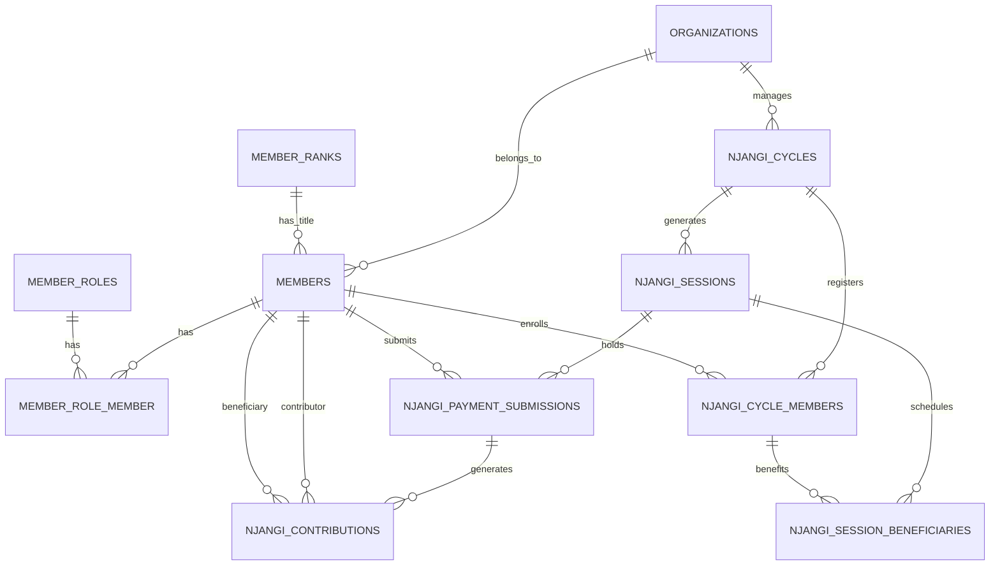

# Project Analysis — NFUH DMV Membership & Njangi System

A comprehensive technical and functional analysis of the **NFUH DMV Membership & Njangi System**.

---

## 1. 🎯 Executive Summary & Purpose

The **NFUH DMV Membership & Njangi System** is a self-owned web application built to manage members, traditional titles, administrative roles, meeting cycles, and financial rotations for the **Nkwen Family Union Houston (NFUH) - DMV Branch**.

### Primary Business Objectives
- **Centralized Membership Management**: Tracking DMV branch members, their geographic locations (Maryland, Virginia, Washington D.C.), seniority (join dates), traditional hierarchy (Titles), and functional positions (Roles).
- **Reciprocal Njangi System**: Streamlining monthly financial rotations, verifying payments (Zelle screenshots), tracking cycle members, and automatically computing financial refunds/obligations dynamically.
- **Future Modular Extensions**: Laying the foundation for financial Savings pools, member Loan management, and Free Will Donation campaigns.

---

## 2. 🛠️ Technology Stack & Dependencies

The system is constructed using modern PHP/Laravel ecosystem tools:
- **Core Framework**: Laravel 11/12 (PHP 8.2+ compatible).
- **Database Engine**: SQLite (`database/database.sqlite` used locally).
- **Frontend Assets**: Vite, TailwindCSS (configured via `tailwind.config.js` and `postcss.config.js`).
- **Authentication**: Laravel Breeze (session-based authentication).
- **Access Control**: Spatie Laravel Permission (`spatie/laravel-permission`).
- **Data Imports**: Maatwebsite Excel (`maatwebsite/excel` / PHPSpreadsheet).

---

## 3. 🗄️ Database Architecture & Schemas

The database structure spans core identity, access control, and financial operations. Here is a breakdown of the database tables:



### Table Details

#### 1. Identity & Membership
- **`organizations`**: Global tenant separator (default: `NFUH DMV`).
- **`member_ranks`**: Stores traditional hierarchy titles (e.g., `HRH`, `Nformi`, `Tamfuh`, `Ngwang`, `Ngwaye`, `Gwei`, `Lagham`). Referenced as **Title** in the UI.
- **`members`**: Holds demographic and participation flags:
  - `member_code`: Unique ID formatted as `STATE-YEAR-SEQUENCE` (e.g., `MD-2026-001`).
  - `state_code`: Geographic constraint (`MD`, `VA`, `DC`).
  - `join_date`: Start date used to extract the year of registration.
  - `participates_in_njangi`: Boolean.
  - `participates_in_savings`: Boolean.
  - `participates_in_cultural`: Boolean (mandatory by default, cultural participation is baseline).
  - Next of Kin fields: `next_of_kin_name`, `next_of_kin_phone`, `next_of_kin_email`, `next_of_kin_address`.
- **`member_roles`**: Administrative roles (e.g., `Secretary`, `Treasurer`, `Financial Secretary`, `Loan Officer`, `Lead Nformi`).
- **`member_role_member`**: Many-to-many pivot mapping members to administrative roles.

#### 2. Njangi Module
- **`njangi_cycles`**: Tracks cycles (e.g., `2026 Njangi Cycle`) with start/end dates and status (`draft`, `active`, `closed`, `cancelled`).
- **`njangi_cycle_members`**: Link between members and a cycle. Stores the monthly subscription amount and `benefit_order`.
- **`njangi_sessions`**: Monthly meeting points. Tracks title, date, sequence number, and status (`scheduled`, `open`, `closed`).
- **`njangi_session_beneficiaries`**: Stores which members benefit in which session.
- **`njangi_payment_submissions`**: Initial user payment record. Stores the requested amount, is_attending attendance status, a required screenshot path, and review status (`pending`, `approved`, `rejected`).
- **`njangi_contributions`**: Official ledger records created only upon approval of submissions. Connects contributor, beneficiary, session, cycle, and payment submission.
- **`njangi_disbursements`**: Official record of when money is sent out to the session beneficiaries.

---

## 4. 🧠 Core Business Logic & Workflows

### 4.1. Unique Member ID Formula
Member IDs follow a custom geographic-seniority format:
$$\text{STATE-YEAR-SEQUENCE}$$
- Generated during member creation in [MemberController::generateMemberCode](file:///c:/xampp/htdocs/nfuh-dmv-system/app/Http/Controllers/MemberController.php#L202-L220).
- State and Year are extracted from `state_code` and `join_date`.
- Sequence increments by 1 for members of the same state and year, padded to 3 digits (e.g., `MD-2024-001`, `MD-2024-002`).
- Editing a member's state or join date does not regenerate the ID to maintain historic identity stability.

### 4.2. Titles vs. Ranks Wording
Traditional Njangi systems utilize hierarchy titles. To avoid database schema disruptions, the database keeps the table name `member_ranks` and column `rank_id`, while the UI consistently presents this column under the label **Title**. A member without an assigned rank displays as **Warrior** (which is not stored as an explicit database record but handled dynamically in blade templates).

### 4.3. Payment Submission and Approval
Njangi contributions follow a multi-step audit path:
1. **Submission**: A member submits a payment request containing an amount, session link, attendance response (Yes/No), and a mandatory Zelle screenshot.
2. **Review**: The submission status remains `pending` in `njangi_payment_submissions`.
3. **Approval**: The Treasurer verifies the payment and approves the submission.
4. **Contribution Split**: Upon approval, [ApproveNjangiPaymentSubmission](file:///c:/xampp/htdocs/nfuh-dmv-system/app/Services/Njangi/ApproveNjangiPaymentSubmission.php) creates official ledger records in `njangi_contributions`. If a session has multiple beneficiaries (typically 4), a separate contribution record is created for each beneficiary.
5. **Double Approval Prevention**: Service-level constraints check for existing records linking the submission ID, contributor, and beneficiary to prevent duplicate ledger entries.

### 4.4. Reciprocal Refund Principle
Njangi works on a reciprocal financial model. When a member is a beneficiary, other members pay into their pot. When those contributors later benefit, the initial beneficiary must return (refund) the exact same amount.
- Refund balances are calculated dynamically from contribution history rather than stored in a hardcoded database column.
- The last beneficiaries of a cycle do not owe refunds for future sessions since the cycle ends immediately after.

---

## 5. 🔍 Discrepancies & Recommendations

### 5.1. Duplicate Migration Error (Resolved)
During the analysis, a database migration conflict was identified:
- The migration file `2026_05_24_010236_add_payment_submission_id_to_njangi_contributions_table.php` attempted to add the column `payment_submission_id` to the `njangi_contributions` table.
- However, the column was already defined in the main creation migration `2026_04_07_025447_create_njangi_contributions_table.php`.
- **Fix Applied**: The duplicate migration file was removed, and `php artisan migrate:fresh --seed` was successfully run to bring the database to a clean, working state.

### 5.2. Outdated MembersImport Class
- The file [MembersImport.php](file:///c:/xampp/htdocs/nfuh-dmv-system/app/Imports/MembersImport.php) uses an outdated schema model:
  ```php
  Member::create([
      'name' => $row[0] ?? null,
      'email' => $row[1] ?? null,
      ...
  ]);
  ```
- It assumes a single `name` column (now split into `first_name` and `last_name`) and does not supply mandatory attributes like `organization_id`, `state_code`, `join_date`, or generate the custom member code.
- **Recommendation**: Refactor `MembersImport` to split name strings, assign state codes, set join dates, and invoke the member code generator service during import loops.

### 5.3. Missing Njangi Test Seeder Parameters
- [NjangiTestSeeder.php](file:///c:/xampp/htdocs/nfuh-dmv-system/database/seeders/NjangiTestSeeder.php) does not define the mandatory foreign key `organization_id` when seeding cycles and sessions.
- **Recommendation**: Retrieve the default organization (`Organization::first()`) and pass its ID when seeding Njangi cycles, cycle members, and sessions.

### 5.4. Environment PHP Version Mismatch (ParseError in Tests)
- The project dependencies locked in `composer.lock` use modern syntax (e.g. typed class constants like `public const int STDIN = 0;` in `sebastian/environment` and PHP 8.4 requirements in Symfony v8 packages).
- However, the local XAMPP environment uses PHP **8.2.12**.
- While running `composer install` succeeds when using the `--ignore-platform-reqs` flag, attempting to run commands that execute these libraries (such as running tests via Pest or phpunit) results in compile-time parser errors:
  ```
  ParseError: syntax error, unexpected identifier "STDIN", expecting "=" in vendor\sebastian\environment\src\Console.php on line 41
  ```
- **Recommendation**: Upgrade the local PHP environment in XAMPP to PHP **8.3+** (ideally **8.4** to fully satisfy Symfony packages without platform bypass flags) or configure the composer configuration to target PHP 8.2 compatible packages.

---

## 6. 🚦 Next Steps & Roadmap

Based on the documentation files and current implementation state, the system is entering **Phase 3 — Njangi Module Completion**:
1. **Njangi Cycle Seeding & Management**: Fixing `NjangiTestSeeder.php` to align with the database constraint and verifying cycle creation.
2. **Session Generation**: Enhancing the session creation engine to support variable beneficiary distribution (minimum of 4 per session).
3. **Disbursement Tracking**: Implementing interfaces and controllers for recording payouts to session beneficiaries.
4. **Member Dashboard**: Building a visualization layer showing personal cycle status, benefit order position, upcoming sessions, contribution history, and calculated refund obligations.
